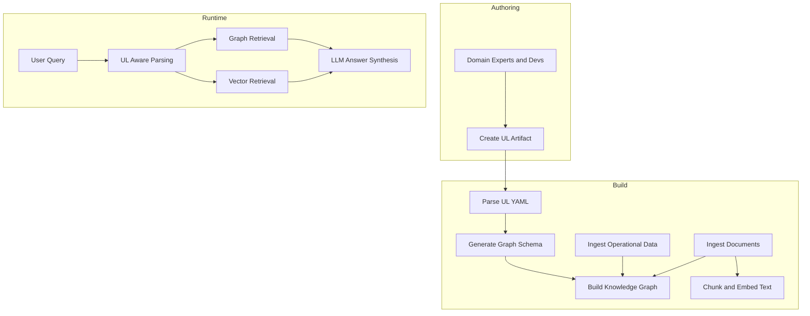

# Knowledge-Graph RAG driven by Ubiquitous Language

## 1. Is this viable?

Using a Ubiquitous Language artifact as an input source for a knowledge‑graph‑centric RAG (GraphRAG) is not only viable but aligns well with how knowledge graphs are modeled from domain concepts and relationships.[web:9][web:16][web:14][web:15][web:21] 

- In DDD, the UL already encodes domain terms, relationships, constraints, and bounded contexts; these are exactly what a knowledge graph needs as nodes, edges, and schema constraints.[web:9][web:16][web:22][web:25]    
- GraphRAG practices recommend first modeling the domain (entities, relationships, ontologies) and then constructing a graph from text or structured sources; a UL document can be the highest‑quality starting point for that model.[web:14][web:15][web:17][web:21][web:24]  

Where it can struggle:

- A UL alone does not give you *instances* (facts like “Loan 123 has outstanding balance USD 5,000”); you still need operational/analytic data or documents ingested into the graph.[web:14][web:18][web:21]    
- If the UL is fuzzy (mixing multiple bounded contexts, inconsistent terms), the graph schema will inherit that ambiguity.[web:16][web:22][web:28]  

Conclusion: Use the UL as “semantic skeleton” (ontology, glossary, invariants) and combine it with document/data ingestion to populate the knowledge graph for RAG.
---

## 2. Recommended UL artifact format

Design the UL artifact as **structured Markdown + embedded YAML blocks**, so it is both human friendly and machine parseable.

### 2.1 Top-level structure

Recommended sections:

 1. # Bounded Contexts     
2. # Concepts (glossary of terms)    
 3. # Relationships     
 4. # Invariants & Policies     
 5. # Events & Workflows     
6. # Mapping to Implementation (optional)

Each concept and relationship is expressed in a **YAML block** plus a concise textual explanation.

### 2.2 Concept definition template

## **Concept: Loan**

type: concept  
name: Loan  
bounded_context: 401kLoans  
kind: aggregate_root           # entity | value_object | aggregate_root | domain_service | policy  
description: >  
  A loan taken by a participant against their 401(k) plan balance.  
canonical_questions:  
  - What is the current outstanding balance of a loan?  
  - When will a loan be fully repaid?  
key_properties:  
  - name: loanId  
    type: string  
    description: Business identifier assigned by the recordkeeping system.  
  - name: principalAmount  
    type: money  
    description: Original loan principal amount at origination.  
  - name: outstandingBalance  
    type: money  
    description: Remaining unpaid principal.  
  - name: interestRate  
    type: percentage  
    description: Annual interest rate charged on the loan.  
  - name: status  
    type: enum  
    values: [PendingApproval, Active, Delinquent, Defaulted, Closed]  
    description: Current lifecycle status of the loan.  
domain_statements:  
  - A Loan must reference exactly one Participant.  
  - A Loan belongs to exactly one Plan.  
  - A Participant may have multiple concurrent Loans if allowed by plan rules.

Narrative explanation (1–3 sentences) follows the block:

*The Loan is the main aggregate for participant borrowing within the 401(k) Loan context. It controls creation, repayment, and transitions between statuses such as Active, Delinquent, and Defaulted.*

## **2.3 Relationship definition template**

text

### Relationship: Participant borrows Loan

type: relationship  
name: ParticipantBorrowsLoan  
bounded\_context: 401kLoans  
from: Participant  
to: Loan  
cardinality: "1:N"  
description: \>  
A participant may have zero or more loans; each loan belongs to exactly one participant.  
semantics:

* A Loan without a Participant is invalid.  
* A Participant may be restricted to a maximum number of concurrent Active loans.  
  constraint\_tags:  
* eligibility  
* compliance

text

### 2.4 Invariants and policies

## **Policy: Maximum Outstanding Loan Amount**

text

type: policy  
name: MaxOutstandingLoanAmount  
bounded_context: 401kLoans  
applies_to: Loan  
description: >  
  Limits participant borrowing based on balance and regulatory rules.  
rule_statements:  
  - The total outstanding loan principal for a participant cannot exceed a configured fraction of the vested account balance.  
  - Loans exceeding the configured threshold must be rejected at origination.  
tags:  
  - risk  
  - compliance

## **2.5 Events and workflows**

text

### Domain Event: LoanRequested

type: domain\_event  
name: LoanRequested  
bounded\_context: 401kLoans  
emitted\_by: LoanApplicationService  
attributes:

* name: participantId  
  type: string  
* name: requestedAmount  
  type: money  
* name: requestedTermMonths  
  type: integer  
* name: requestedPurpose  
  type: string  
  downstream\_effects:  
* Triggers eligibility checks and plan rules evaluation.

text

These structures are designed so that:

- A graph builder can directly map **concepts** to node types, **relationships** to edge types, **policies** to constraints/annotations, and **events** to either nodes or edges with timestamps.[web:14][web:15][web:17][web:21]    
- An LLM can ingest the same artifact to align its vocabulary with the graph schema for RAG.[web:18][web:21][web:24]  

---

## 3. Generic transformation template (UL → GraphRAG)

This is a high‑level transformation template that you can implement as code or prompt‑driven pipelines.

# **Generic UL → Knowledge Graph RAG Transformation Template**

## **Step 0: Inputs**

* UL artifact: Structured Markdown with YAML blocks (concepts, relationships, policies, events).  
* Domain documents: Plan documents, procedures, FAQs, regulations.  
* Operational data (optional): Tables with loans, participants, transactions.

## **Step 1: Parse UL artifact**

1. Extract all YAML blocks with type: concept, type: relationship, type: policy, type: domain\_event.  
2. Build an in‑memory model:  
   * Concept { name, kind, properties, boundedContext, descriptions }  
   * Relationship { from, to, cardinality, semantics }  
   * Policy { rules, tags }  
   * DomainEvent { attributes, downstream\_effects }

## **Step 2: Generate graph schema**

1. For each Concept, generate a node label:  
   * (:Loan {loanId, principalAmount, outstandingBalance, ...})  
2. For each Relationship, generate an edge type:  
   * (:Participant)-\[:BORROWS\]-\>(:Loan)  
3. Attach policy/invariant metadata as:  
   * node/edge properties, or  
   * separate :Policy nodes linked via (:Loan)-\[:GOVERNS\_BY\]-\>(:Policy).

## **Step 3: Populate graph with instances**

1. Ingest operational data:  
   * Map tables to concepts (e.g., Loans table → Loan nodes).  
   * Use foreign keys to create edges based on UL relationships.  
2. Ingest documents:  
   * For each document, run NER/relationship extraction guided by UL concept/relationship names.  
   * Create nodes/edges for referenced entities and link to :Document nodes.

## **Step 4: Build RAG indices**

1. Graph store (e.g., Neo4j, other property graph / RDF):  
   * Stores nodes, edges, and policy metadata.  
2. Vector store:  
   * Chunk domain documents and UL narrative sections.  
   * Embed and index chunks; store pointers to related graph nodes.

## **Step 5: Query‑time orchestration**

Given a user question (e.g., “When does my loan default?”):

1. UL‑aware parsing:  
   * Classify concepts and relationships mentioned (Loan, Delinquent, Defaulted, Participant).  
2. Graph retrieval:  
   * Traverse the knowledge graph to fetch relevant:  
     * concept definitions, policies, and relationships,  
     * participant/loan instances (if tenant‑scoped).  
3. Text retrieval:  
   * Use the same UL terms as search anchors to retrieve highly relevant chunks from the vector store.  
4. Answer synthesis:  
   * Build a prompt that includes:  
     * UL definitions and policies,  
     * relevant subgraph (edges and nodes),  
     * retrieved text chunks,  
   * Ask the LLM to answer using the UL vocabulary and to surface graph‑backed explanations.

## **Step 6: Feedback & refinement**

1. Log which nodes/edges and UL entries were used for successful answers.  
2. Update UL artifact and graph schema with new concepts/policies as they emerge.

text

---

## 4. Sample 401(k) Loans UL file (subset)

This is an example UL artifact for a **401(k Loans** bounded context, using the format above. It is intentionally partial but representative.

# **Ubiquitous Language: 401k Loans**

## **Bounded Contexts**

text

type: bounded_context  
name: 401kLoans  
description: >  
  Handles initiation, approval, servicing, and payoff of participant loans against 401(k) plan balances.  
neighbors:  
  - ParticipantAccounts  
  - PlanAdministration  
  - PayrollDeductions

## **Concepts**

## **Concept: Participant**

type: concept  
name: Participant  
bounded_context: 401kLoans  
kind: entity  
description: >  
  An individual enrolled in one or more 401(k) plans and eligible, under certain rules, to request loans.  
key_properties:  
  - name: participantId  
    type: string  
  - name: name  
    type: string  
  - name: employmentStatus  
    type: enum  
    values: [Active, Terminated, Retired, OnLeave]  
domain_statements:  
  - A Participant may be eligible or ineligible for new loans based on plan rules and employment status.

## **Concept: Plan**

type: concept  
name: Plan  
bounded_context: 401kLoans  
kind: entity  
description: >  
  A 401(k) retirement plan that defines eligibility, limits, and rules for loans.  
key_properties:  
  - name: planId  
    type: string  
  - name: name  
    type: string  
  - name: loanAllowed  
    type: boolean  
  - name: maxConcurrentLoans  
    type: integer  
  - name: maxOutstandingLoanRatio  
    type: percentage  
domain_statements:  
  - A Plan may choose to disallow loans entirely.  
  - Each Plan defines its own loan limits and terms.

## **Concept: Loan**

type: concept  
name: Loan  
bounded_context: 401kLoans  
kind: aggregate_root  
description: >  
  A loan taken by a Participant against their 401(k) Plan balance.  
key_properties:  
  - name: loanId  
    type: string  
  - name: participantId  
    type: string  
  - name: planId  
    type: string  
  - name: principalAmount  
    type: money  
  - name: outstandingBalance  
    type: money  
  - name: interestRate  
    type: percentage  
  - name: termMonths  
    type: integer  
  - name: originationDate  
    type: date  
  - name: maturityDate  
    type: date  
  - name: status  
    type: enum  
    values: [PendingApproval, Active, Grace, Delinquent, Defaulted, Closed]  
domain_statements:  
  - A Loan is originated only if the Participant and Plan pass eligibility checks.  
  - A Loan is considered fully repaid when outstandingBalance is zero and status becomes Closed.  
canonical_questions:  
  - What is the outstanding balance and payoff date for a Loan?  
  - Under what conditions does a Loan become Delinquent or Defaulted?

## **Concept: RepaymentSchedule**

type: concept  
name: RepaymentSchedule  
bounded_context: 401kLoans  
kind: value_object  
description: >  
  The schedule of periodic payments required to repay a Loan.  
key_properties:  
  - name: frequency  
    type: enum  
    values: [Weekly, BiWeekly, SemiMonthly, Monthly]  
  - name: paymentAmount  
    type: money  
  - name: firstPaymentDate  
    type: date  
  - name: lastPaymentDate  
    type: date  
domain_statements:  
  - The RepaymentSchedule is recalculated when the Loan is reamortized.

## **Relationships**

## **Relationship: Participant borrows Loan**

type: relationship  
name: ParticipantBorrowsLoan  
bounded_context: 401kLoans  
from: Participant  
to: Loan  
cardinality: "1:N"  
description: >  
  A Participant may have multiple Loans; each Loan belongs to exactly one Participant.  
semantics:  
  - A Loan cannot exist without a Participant.

## **Relationship: Loan belongs to Plan**

type: relationship  
name: LoanBelongsToPlan  
bounded_context: 401kLoans  
from: Loan  
to: Plan  
cardinality: "N:1"  
description: >  
  A Loan is governed by a single Plan's rules.  
semantics:  
  - Plan loan rules apply to all Loans referencing that Plan.

## **Relationship: Loan has RepaymentSchedule**

type: relationship  
name: LoanHasRepaymentSchedule  
bounded_context: 401kLoans  
from: Loan  
to: RepaymentSchedule  
cardinality: "1:1"  
description: >  
  Each Loan has exactly one RepaymentSchedule at any point in time.  
semantics:  
  - When a Loan is reamortized, the RepaymentSchedule is replaced.

## **Policies & Invariants**

## **Policy: Maximum Outstanding Loan Amount**

text

type: policy  
name: MaxOutstandingLoanAmount  
bounded_context: 401kLoans  
applies_to: Loan  
description: >  
  Limits participant borrowing based on plan rules and regulatory thresholds.  
rule_statements:  
  - The sum of outstandingBalance for all Active Loans of a Participant in a Plan must not exceed Plan.maxOutstandingLoanRatio of the Participant's vested balance in that Plan.  
  - Any new Loan request that would violate this rule must be rejected.  
tags:  
  - compliance  
  - eligibility

## **Policy: Maximum Concurrent Loans**

text

type: policy  
name: MaxConcurrentLoans  
bounded_context: 401kLoans  
applies_to: Loan  
description: >  
  Limits the number of Loans a Participant can have concurrently in a Plan.  
rule_statements:  
  - The number of Active Loans a Participant has in a Plan must not exceed Plan.maxConcurrentLoans.  
  - If the limit is reached, new Loan requests must be rejected.  
tags:  
  - risk  
  - plan_rule

## **Policy: Delinquency and Default**

text

type: policy  
name: DelinquencyAndDefault  
bounded_context: 401kLoans  
applies_to: Loan  
description: >  
  Defines when a Loan transitions to Delinquent or Defaulted based on missed payments and grace periods.  
rule_statements:  
  - A Loan enters status Grace when a scheduled payment is missed.  
  - A Loan becomes Delinquent when payments remain unpaid after the configured grace period.  
  - A Loan becomes Defaulted when delinquency exceeds the maximum allowed period.  
tags:  
  - servicing  
  - collections

## **Domain Events**

## **Domain Event: LoanRequested**

text

type: domain_event  
name: LoanRequested  
bounded_context: 401kLoans  
emitted_by: LoanApplicationService  
attributes:  
  - name: participantId  
    type: string  
  - name: planId  
    type: string  
  - name: requestedAmount  
    type: money  
  - name: requestedTermMonths  
    type: integer  
downstream_effects:  
  - Triggers Plan and Participant eligibility checks.

## **Domain Event: LoanApproved**

type: domain_event  
name: LoanApproved  
bounded_context: 401kLoans  
emitted_by: LoanDomainService  
attributes:  
  - name: loanId  
    type: string  
  - name: participantId  
    type: string  
  - name: planId  
    type: string  
downstream_effects:  
  - Creates the Loan aggregate and RepaymentSchedule.  
  - Notifies PayrollDeductions to start loan repayment deductions.

## **Domain Event: LoanDefaulted**

type: domain_event  
name: LoanDefaulted  
bounded_context: 401kLoans  
emitted_by: Loan  
attributes:  
  - name: loanId  
    type: string  
  - name: defaultDate  
    type: date  
downstream_effects:  
  - Notifies tax reporting services to handle deemed distributions as required by regulation.

---

## 5. Mermaid diagram of the flow

This diagram shows the flow from UL artifact to GraphRAG query answering.

---

## 6. If you decide UL‑only is not enough

If you find the UL artifact alone is too abstract, the main alternatives are:

- **UL + annotated example scenarios**: Extend the UL with worked examples (loan lifecycle scenarios) expressed as small event timelines that can be turned into graph test data.    
- **UL + auto‑extracted graph from documents**: Use the UL vocabulary as a constraint when extracting entities/relations from documents into the graph.[web:14][web:18][web:21][web:24]    
- **Multi‑context ULs + federated graph**: For multiple bounded contexts, maintain separate UL artifacts and merge them into a federated or layered knowledge graph, preserving boundaries but enabling cross‑context queries.[web:16][web:20][web:24]  

These patterns keep the UL as the semantic core while ensuring your GraphRAG has enough concrete data and examples to answer realistic question
