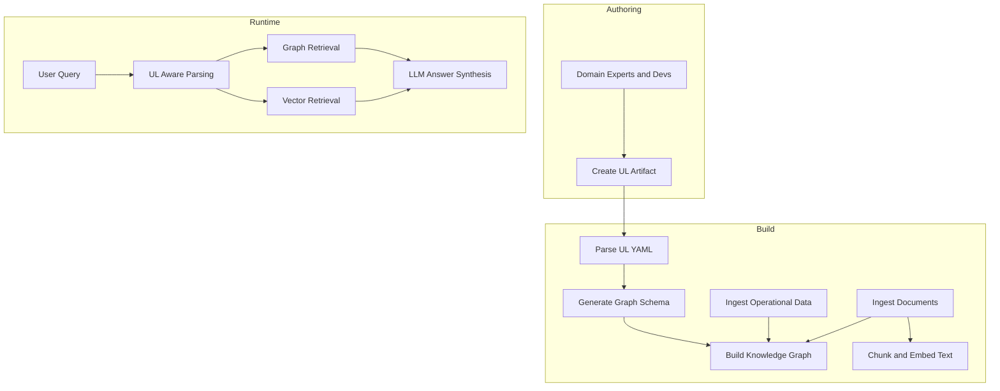

# Ubiquitous Language (Template)

## Delivery workflow (batch first)

- Generate the UL content in small batches and write each batch to Parquet.
- After all batches are complete, assemble the final Markdown deliverable from Parquet.
- The final Markdown still follows sections 1-7 below.
- Use `workspace\.venv\Scripts\python.exe workspace\scripts\assemble_ul_from_parquet.py` to build the final Markdown in order.
- Store UL section batches under `workspace/deliverables/generated/ul-parquet/ul-sections/`.
- Store UL graph artifacts under `workspace/deliverables/generated/ul-parquet/nodes/` and `workspace/deliverables/generated/ul-parquet/edges/`.

## 1. Is this viable?

Describe why a ubiquitous language (UL) artifact is a strong foundation for knowledge capture in this domain. Include:
- Where it fits well (domain terms, relationships, policies).
- Where it can struggle (missing instances, ambiguous terms).
- Conclusion and when to supplement with additional sources.

---

## 2. Recommended UL artifact format

Use structured Markdown with embedded YAML blocks so the artifact is human-friendly and machine-parseable.

### 2.1 Top-level structure

Recommended sections:
1. Bounded Contexts
2. Concepts (glossary of terms)
3. Relationships
4. Invariants and Policies
5. Events and Workflows
6. Mapping to Implementation (optional)

### 2.2 Concept definition template

## Concept: <ConceptName>

type: concept
name: <ConceptName>
bounded_context: <ContextName>
kind: <entity|value_object|aggregate_root|domain_service|policy>
description: >
  <Business definition in plain language.>
canonical_questions:
  - <Question 1>
  - <Question 2>
key_properties:
  - name: <propertyName>
    type: <type>
    description: <business meaning>
  - name: <propertyName>
    type: <type>
    description: <business meaning>
domain_statements:
  - <Constraint or invariant stated in business terms.>

Narrative explanation (1-3 sentences) follows the block:
<Short narrative that explains the concept in business terms.>

### 2.3 Relationship definition template

### Relationship: <Subject> <verb> <Object>

type: relationship
name: <RelationshipName>
bounded_context: <ContextName>
from: <Subject>
to: <Object>
cardinality: "<1:1|1:N|N:1|N:N>"
description: >
  <Business definition of the relationship.>
semantics:
  - <Business rule or constraint.>
  - <Business rule or constraint.>
constraint_tags:
  - <tag>
  - <tag>

### 2.4 Invariants and policies

## Policy: <PolicyName>

type: policy
name: <PolicyName>
bounded_context: <ContextName>
applies_to: <ConceptName>
description: >
  <Business rule description.>
rule_statements:
  - <Rule statement in business language.>
  - <Rule statement in business language.>
tags:
  - <tag>
  - <tag>

### 2.5 Events and workflows

### Domain Event: <EventName>

type: domain_event
name: <EventName>
bounded_context: <ContextName>
emitted_by: <ProcessOrServiceName>
attributes:
  - name: <attributeName>
    type: <type>
  - name: <attributeName>
    type: <type>
downstream_effects:
  - <Effect in business terms.>
  - <Effect in business terms.>

---

## 3. Generic transformation template (UL to Knowledge Graph RAG)

### Step 0: Inputs

- UL artifact: Structured Markdown with YAML blocks (concepts, relationships, policies, events).
- Domain documents: <list sources>.
- Operational data (optional): <list datasets>.

### Step 1: Parse UL artifact

1. Extract all YAML blocks for concepts, relationships, policies, and domain events.
2. Build an in-memory model:
   - Concept { name, kind, properties, boundedContext, descriptions }
   - Relationship { from, to, cardinality, semantics }
   - Policy { rules, tags }
   - DomainEvent { attributes, downstream_effects }

### Step 2: Generate graph schema

1. For each Concept, generate a node label and properties.
2. For each Relationship, generate an edge type.
3. Attach policy/invariant metadata as node or edge properties, or as separate Policy nodes.

### Step 3: Populate graph with instances

1. Ingest operational data and map tables to concepts.
2. Ingest documents and extract entities/relationships guided by UL terms.

### Step 4: Build RAG indices

1. Graph store (e.g., Neo4j) holds nodes, edges, and policy metadata.
2. Vector store holds embedded chunks from UL narratives and documents.

### Step 5: Query-time orchestration

1. Parse user queries with UL-aware concept detection.
2. Retrieve subgraphs and relevant text chunks.
3. Synthesize answers using UL vocabulary and graph-backed explanations.

### Step 6: Feedback and refinement

1. Log which UL entries and graph elements were used.
2. Update UL artifacts and schema as new concepts emerge.

---

## 4. Sample <DomainName> UL file (subset)

# Ubiquitous Language: <DomainName>

## Bounded Contexts

type: bounded_context
name: <ContextName>
description: >
  <Business scope of the context.>
neighbors:
  - <NeighborContext>
  - <NeighborContext>

## Concepts

## Concept: <ConceptName>

type: concept
name: <ConceptName>
bounded_context: <ContextName>
kind: <entity|value_object|aggregate_root>
description: >
  <Business definition.>
key_properties:
  - name: <propertyName>
    type: <type>
domain_statements:
  - <Business constraint.>
canonical_questions:
  - <Question in business terms.>

## Relationships

## Relationship: <Subject> <verb> <Object>

type: relationship
name: <RelationshipName>
bounded_context: <ContextName>
from: <Subject>
to: <Object>
cardinality: "<1:1|1:N|N:1|N:N>"
description: >
  <Business definition of the relationship.>
semantics:
  - <Business rule or constraint.>

## Policies and Invariants

## Policy: <PolicyName>

type: policy
name: <PolicyName>
bounded_context: <ContextName>
applies_to: <ConceptName>
description: >
  <Business rule description.>
rule_statements:
  - <Rule statement in business language.>

## Domain Events

## Domain Event: <EventName>

type: domain_event
name: <EventName>
bounded_context: <ContextName>
emitted_by: <ProcessOrServiceName>
attributes:
  - name: <attributeName>
    type: <type>
downstream_effects:
  - <Effect in business terms.>

---

## 5. Mermaid diagram of the flow



---

## 6. If UL-only is not enough

List alternatives and enhancements if the UL artifact alone is too abstract:
- UL plus example scenarios
- UL plus document extraction
- Multi-context ULs with a federated graph

---

## 7. Graph artifacts (generated)

After sections 1-6, generate graph artifacts derived from the UL as Parquet and ingest them into Neo4j.

Parquet output locations:
- `workspace/deliverables/generated/ul-parquet/nodes/`
- `workspace/deliverables/generated/ul-parquet/edges/`

Node schema (Parquet columns, aligned to graph loader):
- `id,type,context,name,description,sourceFile,sourceLine,project,ext,entryKind`

Edge schema (Parquet columns, aligned to graph loader):
- `id,type,context,sourceId,targetId,description`

PyArrow schema (nodes):
```python
pa.schema([
    ("id", pa.string()),
    ("type", pa.string()),
    ("context", pa.string()),
    ("name", pa.string()),
    ("description", pa.string()),
    ("sourceFile", pa.string()),
    ("sourceLine", pa.int64()),
    ("project", pa.string()),
    ("ext", pa.string()),
    ("entryKind", pa.string()),
])
```

PyArrow schema (edges):
```python
pa.schema([
    ("id", pa.string()),
    ("type", pa.string()),
    ("context", pa.string()),
    ("sourceId", pa.string()),
    ("targetId", pa.string()),
    ("description", pa.string()),
])
```

Use stable IDs based on UL names (e.g., `concept:<name>`, `relationship:<name>`, `policy:<name>`, `event:<name>`).
Use `context` = `ubiquitous-language` for all UL nodes/edges.

Ingest into Neo4j:
- Run `workspace/scripts/load_graph_vector.py` with `--parquet-root "c:\Users\shara\code\migration\workspace\deliverables\generated\ul-parquet"` and `--skip-qdrant`.

---

## Parquet-first UL output (batching)

Write UL content to Parquet in small batches before assembling the final Markdown:

Parquet output location:
- `workspace/deliverables/generated/ul-parquet/ul-sections/`

Schema (Parquet columns):
- `batch_id,section,subsection,content,context,sourceFile,sourceLine`

PyArrow schema (ul-sections):
```python
pa.schema([
    ("batch_id", pa.string()),
    ("section", pa.string()),
    ("subsection", pa.string()),
    ("content", pa.string()),
    ("context", pa.string()),
    ("sourceFile", pa.string()),
    ("sourceLine", pa.int64()),
])
```

Batching rules:
- Keep batches to 200-300 files or 200-500 records per batch.
- Each batch must include citations and reference the citation index.
- Each Parquet row should contain content for a single section/subsection (do not repeat the full template per batch).
- After all batches are complete, generate `workspace/deliverables/generated/ubiquitous-language.md` from the Parquet content.
